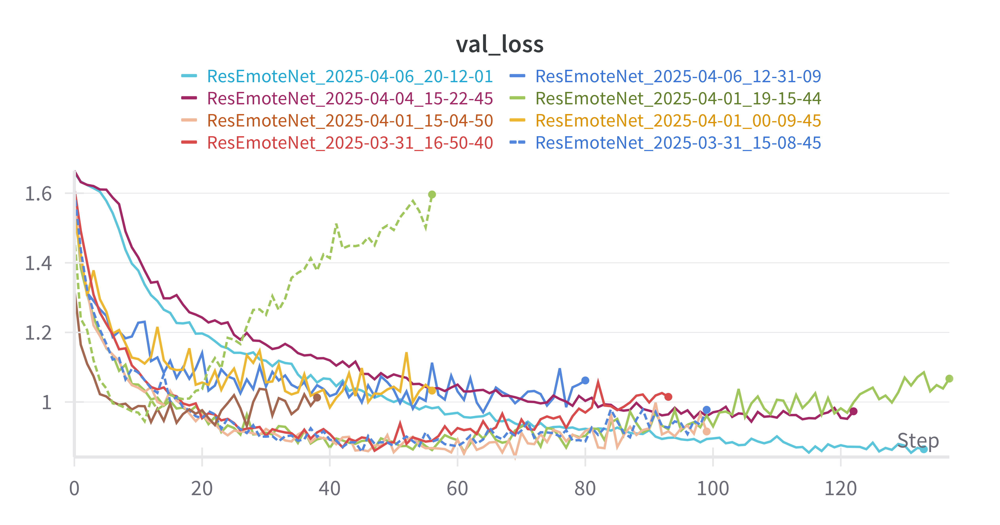
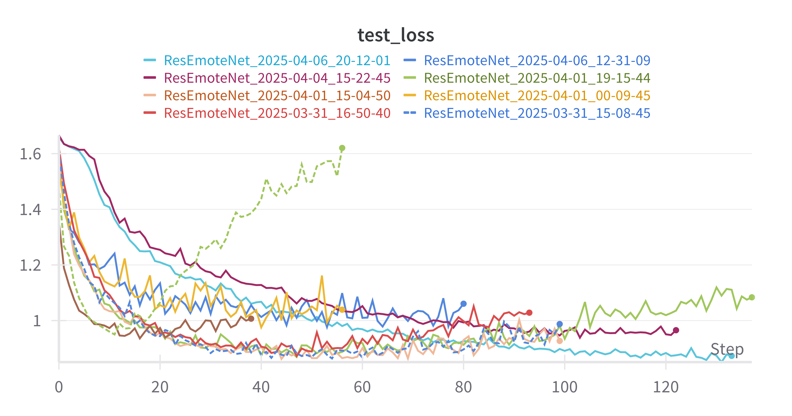
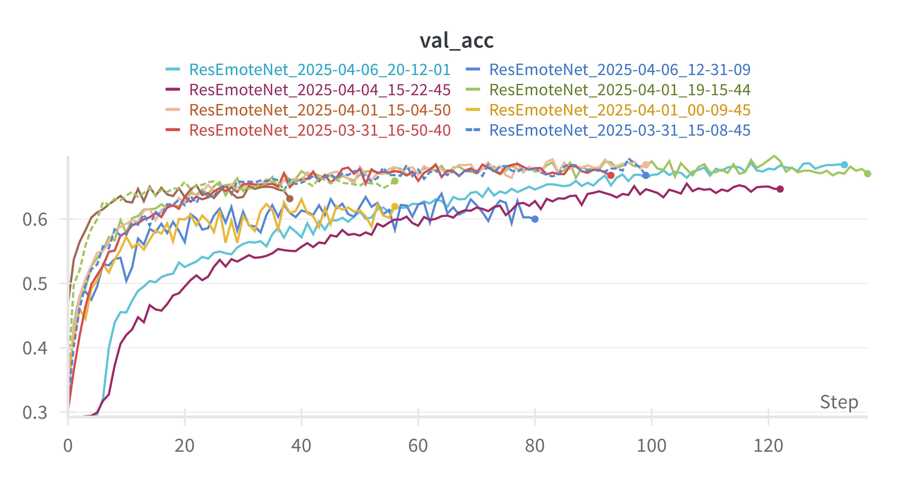
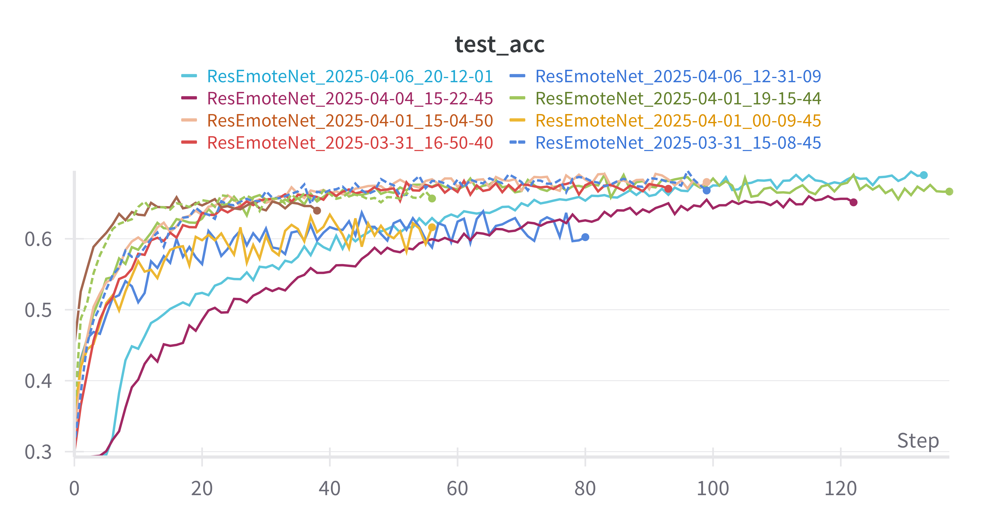

# Emotion-Aware-AI
This research project aims to increase user engagement of learning games with a topic in computer science by dynamically adjusting the difficulty level through an emotion-aware NPC (Non-player character). The NPC, powered by an facial emotion recognition (FER) algorithm that categorizes facial expressions into 8 emotion types (including 3 custom ones), detects the current state of players via a combination of camera feed and in-game text sent between players.

## Data
Following the standard of well-known dataset FER-2013 created by Pierre Luc Carrier and Aaron Courville, integer labels are used to classify facial images expressing eight emotions, three of which (in italics) are tailored to the needs of this project:
- 0: Angry -- 4953
- 1: *Frustration* -- 265
- 2: *Boredom* -- 238
- ~~2: *Distracted*~~
- 3: Happy -- 8989
- 4: Sad -- 6077
- 5: Surprise -- 4002
- 6: Neutral -- 6198
> [!Note]
> *Distracted* is temporarily removed from our training dataset due to a failure in collecting meaningful images expressing this particular emotion. It may be added back in future if we're able to gather relevant images from other sources. Class labels are adjusted accordingly.

### How images are collected for custom emotions
Facial images representing frustration, distracted and boredom are fetched from Google Images using API calls. To ensure the diversity of our images, a basic search string is combined with other keywords like "men", "women" etc. before being passed to an API call. Faces from returned results are then extracted and cropped to a standard size of 48x48 with OpenCV, followed by a conversion to pixel string before being added to a csv file.

Finally, we manually inspect every pixel string to remove incorectly detected faces and dupliate images. This process is performed in each API call that collects 50 images and again every two API calls when a total of 100 images are fetched. 

### How image labels are assigned
We intentionally assigned our custom emotions to the exact two that are removed from the original FER2013 datasets -- disgust and fear, closely aligning our dataset to established practices.

### How to run our image collection program
Since custom images are collected via Google Images API, make sure to load your google API key and custom search engine ID into a .env file in the directory where main.py is located. See Google doc [here](https://developers.google.com/custom-search/v1/overview). Then, simply run `python main.py` in [data](data/main.py) and choose the first option on a menu that pops up.
> [!Note]
> Make sure to comment out the code in `main.py` that checks for `.env` credentials if you don't intend to run this program for image collection. 

> [!CAUTION]
> Other modes in the menu may break since they have been deprecated upon finishing data collection. Please see comments in [main.py](data/main.py). 

## FER Model
We built and experimented with two state-of-the-art [facial emotion recognition(FER)](https://paperswithcode.com/sota/facial-expression-recognition-on-fer2013?p=resemotenet-bridging-accuracy-and-loss) models, [ResEmoteNet](https://arxiv.org/pdf/2409.10545) and [EmoNeXt](https://ieeexplore.ieee.org/abstract/document/10337732), based on their original implementation, with a particular focus on the first due to various research constraints. 

However, it quickly caught my attention that ResEmoteNet performs far worse than the 79.79% test accuracy that the authors claim to have achieved when training with the same FER2013 benchmark dataset. Furthmore, a substantial amount of overfitting was observed when training with the specified hyperparameters from the original paper. These results are illustrated in following graphs

To combat these problems, we explored the following techniques:
- **Spatial Transformation Network(STN)**: strengthen geometric invariance of a neural network model by learning to perform spatial transformation on input images that eliminate translation, rotation and warping.
- **Data augmentation**: enhance existing training data transformation pipeline by adding more data augmentations, such as RandomRotation, RandomAffine etc.;
- **Weighted loss**: scale up cross entropy loss on minority classes and scale down on majority classes;
- **Weighted sampling**: add a `WeightedRandomSampler` to training dataloader to balance sampling probabilities between majority classes and minority classes.

